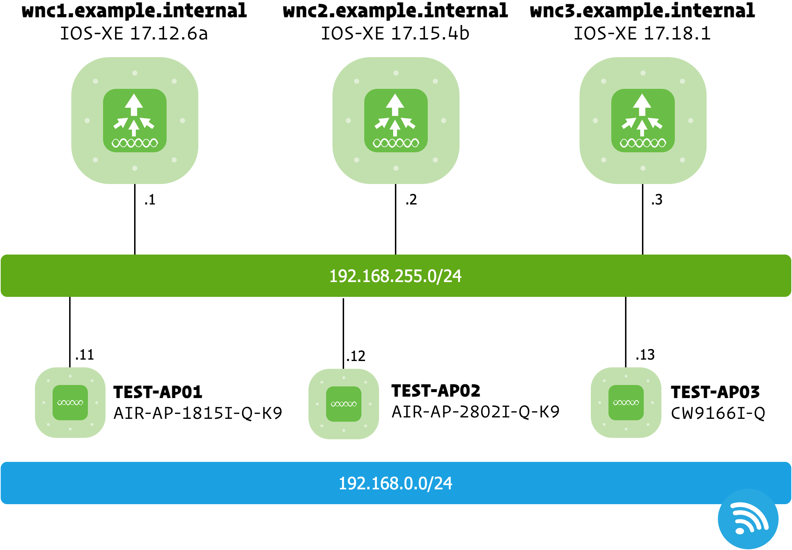

## About Labo Environment

This document provides an overview of the Labo environment, which includes a Cisco Wireless Network Controller and three Cisco Access Points. The Wireless Network Controller is configured with three different versions of IOS-XE to facilitate testing and development.

<div align="center">
  <h3></h3>
</div>

- **Live WNC Versions**:

  - **wnc1.example.internal:** IOS-XE 17.12.6a
  - **wnc2.example.internal:** IOS-XE 17.15.4b
  - **wnc3.example.internal:** IOS-XE 17.18.1

- **Path to YANG Models**:

  - **IOS-XE 17.12.1**: `~/LOCAL/yang/vendor/cisco/xe/17121/`
  - **IOS-XE 17.15.1**: `~/LOCAL/yang/vendor/cisco/xe/17151/`
  - **IOS-XE 17.18.1**: `~/LOCAL/yang/vendor/cisco/xe/17181/`

- **Example to Access Cisco WNC using cURL**:

  - For endpoints under `/restconf/data/` (GET):

    ```
    curl -k -H "Authorization: Basic $WNC_ACCESS_TOKEN" \
             -H "Accept: application/yang-data+json" \
             "https://$WNC_CONTROLLER/restconf/data/Cisco-IOS-XE-wireless-access-point-oper:access-point-oper-data/capwap-data"
    ```

  - For endpoints under `/restconf/data/` with a specific parameter (GET, list key = MAC):

    ```
    curl -k -H "Authorization: Basic $WNC_ACCESS_TOKEN" \
             -H "Accept: application/yang-data+json" \
             "https://$WNC_CONTROLLER/restconf/data/Cisco-IOS-XE-wireless-access-point-oper:access-point-oper-data/capwap-data=00:11:22:33:44:55"
    ```

  - For endpoints under `/restconf/operations/` (POST/PATCH/PUT/DELETE):

    ```
    curl -k -X POST \
            -H "Authorization: Basic $WNC_ACCESS_TOKEN" \
            -H "Content-Type: application/yang-data+json" \
            -d '{"input": {"ap-name": "TEST-AP01"}}' \
            "https://$WNC_CONTROLLER/restconf/operations/Cisco-IOS-XE-wireless-access-point-cmd-rpc:ap-reset"
    ```
