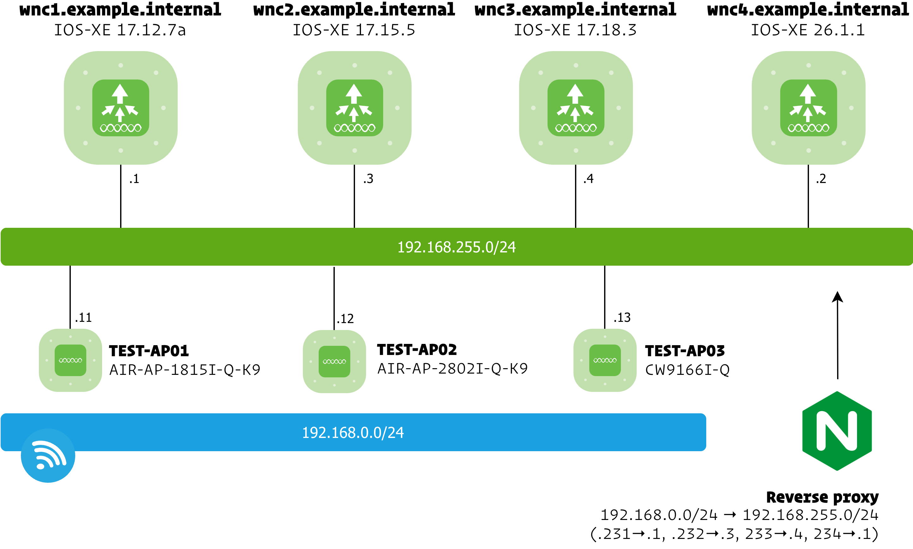

## About Labo Environment

This document provides an overview of the Labo environment, which includes a Cisco Wireless Network Controller and four Cisco Access Points. The Wireless Network Controller is configured with four different versions of IOS-XE to facilitate testing and development.

  <h3></h3>

- **Live WNC Versions**:
  - **wnc1.example.internal:** IOS-XE 17.12.7a
  - **wnc2.example.internal:** IOS-XE 17.15.5
  - **wnc3.example.internal:** IOS-XE 17.18.3
  - **wnc4.example.internal:** IOS-XE 26.1.1

- **Path to YANG Models**:
  - **IOS-XE 17.12.1**: `~/LOCAL/yang/vendor/cisco/xe/17121/`
  - **IOS-XE 17.15.1**: `~/LOCAL/yang/vendor/cisco/xe/17151/`
  - **IOS-XE 17.18.1**: `~/LOCAL/yang/vendor/cisco/xe/17181/`
  - **IOS-XE 26.1.1**: `~/LOCAL/yang/vendor/cisco/xe/2611/`
