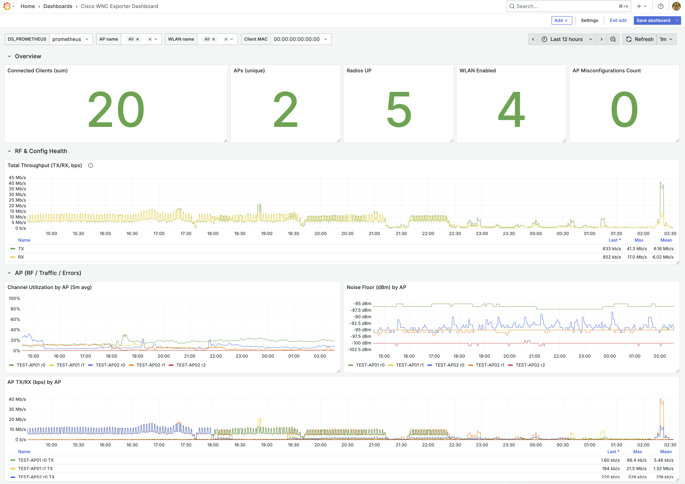

<div align="center">

  <picture>
    <source media="(prefers-color-scheme: dark)" srcset="docs/assets/logo_dark.png" width="180px" />
    <source media="(prefers-color-scheme: light)" srcset="docs/assets/logo.png" width="180px" />
    
  </picture>

  <h1>cisco-wnc-exporter</h1>

  <p>A third-party Prometheus Exporter for Cisco C9800 Wireless Network Controller.</p>

  <p>
    
    <a href="https://github.com/umatare5/cisco-wnc-exporter/actions/workflows/go-test-build.yml"></a>
    
    <a href="https://goreportcard.com/badge/github.com/umatare5/cisco-wnc-exporter"></a><br/>
    <a href="https://www.bestpractices.dev/projects/11293"></a>
    <a href="./LICENSE"></a>
    <a href="https://developer.cisco.com/codeexchange/github/repo/umatare5/cisco-wnc-exporter"></a>
  </p>

</div>

## Overview

This exporter allows a prometheus instance to scrape metrics from [Cisco Catalyst 9800 Wireless Controllers](https://www.cisco.com/site/us/en/products/networking/wireless/wireless-lan-controllers/catalyst-9800-series/index.html).

- 🛡️ **Critical State Monitoring**: Detects changes such as AP mis-configurations or WLAN enable/disable
- 🌐 **Client Connectivity Tracking**: Monitors client signal strength, speed, protocols, traffic and latency
- 📊 **Long-Term Observability**: Extends metric retention for historical analysis and wireless trend tracking
- ↩️ **Pull-Based Telemetry**: Alternative to the [Streaming Telemetry](https://www.cisco.com/c/en/us/td/docs/wireless/controller/9800/17-12/config-guide/b_wl_17_12_cg/streaming-telemetry-on-Cisco-Catalyst-9800-series-wireless-controller.html) feature using RESTCONF APIs

## Quick Start

Please enable RESTCONF and HTTPS on the C9800 before using this exporter. Please see:

- [Cisco IOS XE 17.12 Programmability Configuration Guide — RESTCONF](https://www.cisco.com/c/en/us/td/docs/ios-xml/ios/prog/configuration/1712/b_1712_programmability_cg/m_1712_prog_restconf.html#id_70432)

### 1. Generate a Basic Auth token

Encode your controller credentials as Base64.

```bash
# username:password → Base64
echo -n "admin:your-password" | base64
# Output: YWRtaW46eW91ci1wYXNzd29yZA==
```

### 2. Set required environment variables

```bash
export WNC_CONTROLLER="wnc1.example.internal"
export WNC_ACCESS_TOKEN="YWRtaW46eW91ci1wYXNzd29yZA=="
```

### 3. Run the exporter with Docker

```bash
docker run -p 10039:10039 -e WNC_CONTROLLER -e WNC_ACCESS_TOKEN \
  ghcr.io/umatare5/cisco-wnc-exporter
```

- `-p`: Maps container port `10039/tcp` to host port `10039/tcp`.
- `-e`: Passes the environment variables into the container.

> [!Tip]
> If you prefer using binaries, download them from the [release page](https://github.com/umatare5/cisco-wnc-exporter/releases).
>
> - Supported Platforms: `linux_amd64`, `linux_arm64`, `darwin_amd64`, `darwin_arm64` and `windows_amd64`

## Syntax

`cisco-wnc-exporter --help` prints every flag, and [docs/configuration.md](docs/configuration.md) carries the same list. Each collector is enabled per module:

- `--collector.ap.general`, `.radio`, `.traffic`, `.errors`, `.info`
- `--collector.client.general`, `.radio`, `.traffic`, `.errors`, `.info`
- `--collector.wlan.general`, `.traffic`, `.config`, `.info`

> [!CAUTION]
> The `--wnc.tls-skip-verify` flag disables TLS certificate verification. This should only be used in development environments or when connecting to controllers with self-signed certificates. **Never use this option in production environments** as it compromises security.

## Configuration

This exporter supports following environment variables:

| Environment Variable | Description                                      |
| :------------------- | :----------------------------------------------- |
| `WNC_CONTROLLER`     | WNC controller hostname or IP address (required) |
| `WNC_ACCESS_TOKEN`   | WNC API access token (required)                  |

## Metrics

This exporter collects wireless network metrics from Cisco C9800 WNC using three collectors:

| Collector                          | Focus                                              |
| :--------------------------------- | :------------------------------------------------- |
| [AP](docs/collector.ap.md)         | RF foundation and radio performance                |
| [Client](docs/collector.client.md) | User experience quality and connection performance |
| [WLAN](docs/collector.wlan.md)     | Logical SSID performance and parameter checks      |

Each page lists every metric its collector publishes, the labels its `_info` metric carries, and the counters the controller may report as a constant zero. The `Module` column on those pages names the flag suffix that enables a metric, as in `--collector.ap.radio`.

The series a dashboard usually starts from:

| Collector | Metric                             | Type  | Description                          |
| :-------- | :--------------------------------- | :---- | :----------------------------------- |
| AP        | `wnc_ap_oper_state`                | Gauge | Operational state in `state` label   |
| AP        | `wnc_ap_channel_number`            | Gauge | Operating channel number             |
| AP        | `wnc_ap_tx_power_dbm`              | Gauge | Current transmit power (dBm)         |
| AP        | `wnc_ap_noise_floor_dbm`           | Gauge | Noise on the operating channel (dBm) |
| AP        | `wnc_ap_channel_utilization_ratio` | Gauge | Channel utilization ratio (CCA), 0-1 |
| AP        | `wnc_ap_clients`                   | Gauge | Run-state clients count (calculated) |
| Client    | `wnc_client_state`                 | Gauge | Connection state in `state` label    |
| Client    | `wnc_client_protocol`              | Gauge | 802.11 protocol (0=unknown, 1..7)    |
| Client    | `wnc_client_speed_mbps`            | Gauge | Connection throughput                |
| Client    | `wnc_client_rssi_dbm`              | Gauge | Signal strength (dBm)                |
| Client    | `wnc_client_snr_decibels`          | Gauge | Signal-to-noise ratio (dB)           |
| WLAN      | `wnc_wlan_enabled`                 | Gauge | WLAN status                          |
| WLAN      | `wnc_wlan_clients`                 | Gauge | Run-state clients count (calculated) |

The exporter also exposes the [Exporter Health Metrics](#exporter-health-metrics) series, which describe the exporter itself rather than the wireless network.

> [!Important]
>
> All collectors are **disabled by default** to reduce load on both Prometheus and the Cisco C9800 WNC. Because a Cisco C9800 WNC typically manages hundreds or even thousands of APs and clients, selective monitoring is essential to maintain performance and stability.

> [!Note]
>
> - The controller updates its counters on its own schedule, so use a range of **15 minutes or more** for `rate()` and `increase()`
> - A series carrying a `state` label always has the value `1`, so the label is the reading and `== 0` never fires
> - See [docs/README.md](docs/README.md) for the refresh, caching, counter-reset, state and label semantics every collector shares

### Exporter Health Metrics

These series describe the exporter itself rather than the wireless network. They have no module and no collector flag. Without the refresh series a failed refresh produces a successful scrape carrying no series, which no alert can detect.

| Metric                                  | Type    | Description                                            |
| :-------------------------------------- | :------ | :----------------------------------------------------- |
| `wnc_build_info`                        | Gauge   | Exporter version in the `version` label, always 1      |
| `wnc_up`                                | Gauge   | Whether the last **completed** refresh reached the WNC |
| `wnc_refresh_duration_seconds`          | Gauge   | Duration of the last refresh **attempt**               |
| `wnc_refresh_success_timestamp_seconds` | Gauge   | Start time of the refresh behind the served snapshot   |
| `wnc_refresh_errors_total`              | Counter | Fetch failures per `data` type since start-up          |
| `wnc_refresh_items`                     | Gauge   | Items the last refresh returned per `data` type        |

`wnc_build_info` is registered before any collector, so it is the only series a scrape carries when every collector is disabled. The refresh series appear as soon as one collector is enabled.

> [!Important]
>
> `wnc_up == 1` is not a claim that the data series are present, and `up == 1` is not a claim that the controller is reachable. A scrape always returns 200 because it is served from the cached snapshot, so the target's `up` reports only that the exporter's HTTP server answered.

> [!Note]
>
> `wnc_refresh_items` is recorded on success only, so an absent series means that fetch failed while a zero series means the controller returned nothing. `wnc_refresh_errors_total` is seeded to zero for every `data` type at start-up, which makes it the authoritative list of `data` label values.

## Use Cases

There are multiple ways to run the exporter, including direct binary execution and Docker containerization.

### Exporter Configuration

The exporter serves three endpoints:

- `/` - Landing page. Visit http://localhost:10039/ to verify the exporter is running
- `/metrics` - Metrics endpoint, moved by `--web.telemetry-path`. Pointing it at `/` replaces the landing page
- `/healthz` - Liveness probe. Returns a static 200 and deliberately ignores WNC reachability

> [!Note]
>
> `/healthz` stays liveness-only on purpose. Reflecting the WNC state there would let an orchestrator kill the exporter during a controller outage, taking the stale snapshot and the [Exporter Health Metrics](#exporter-health-metrics) series down with it — exactly when they are needed.

#### Basic Usage - No Collectors

The exporter starts without any collectors enabled by default:

```bash
$ WNC_CONTROLLER="wnc1.example.internal"
$ WNC_ACCESS_TOKEN="foobarbaz"
$ ./cisco-wnc-exporter
time="2025-04-13T18:50:54Z" level=info msg="Starting the cisco-wnc-exporter on port 10039."
```

#### Essential Usage

Enable essential collectors for basic monitoring:

```bash
$ WNC_CONTROLLER="wnc1.example.internal"
$ WNC_ACCESS_TOKEN="foobarbaz"
$ ./cisco-wnc-exporter \
    --collector.ap.general --collector.client.general --collector.wlan.general
```

#### Complete Usage

For complete monitoring, see [`.air.toml`](./.air.toml) which enables all collectors with maximum info-labels.

### Prometheus Configuration

This section describes how to configure Prometheus to scrape metrics from the cisco-wnc-exporter.

#### Job Configuration Example

Add the job config to your Prometheus YAML file using [examples/prometheus.yml](./examples/prometheus.yml) as a reference.

> [!Note]
>
> A refresh starts on the first scrape that arrives after `--wnc.cache-ttl` has elapsed since the previous refresh finished, so the effective refresh period is:
>
> ```text
> P = scrape_interval * ceil((cache-ttl + R) / scrape_interval)
> ```
>
> - `R`: The refresh duration, which `wnc_refresh_duration_seconds` reports.
> - `P`: 120 seconds for `R` of 5 to 65 seconds at a 60s `scrape_interval`.

#### Alerting Rules Configuration Example

Add the alerting rules to your Prometheus YAML file using [examples/prometheus_alert_rules.yml](./examples/prometheus_alert_rules.yml) as a reference.

### Example Grafana Dashboard

<picture>
  <source media="(prefers-color-scheme: dark)" srcset="docs/assets/cisco-wnc-exporter-dashboard_dark.png">
  <source media="(prefers-color-scheme: light)" srcset="docs/assets/cisco-wnc-exporter-dashboard.png">
  
</picture>

## Contributing

See [CONTRIBUTING.md](CONTRIBUTING.md) for the `make` targets, the Docker build, the release process and how to open a pull request.

## Acknowledgement

I launched this project with the help of **GitHub Copilot Coding Agent**, and I am grateful to the global developer community for their contributions to open source projects and public repositories.

## Licence

[MIT](LICENSE)
