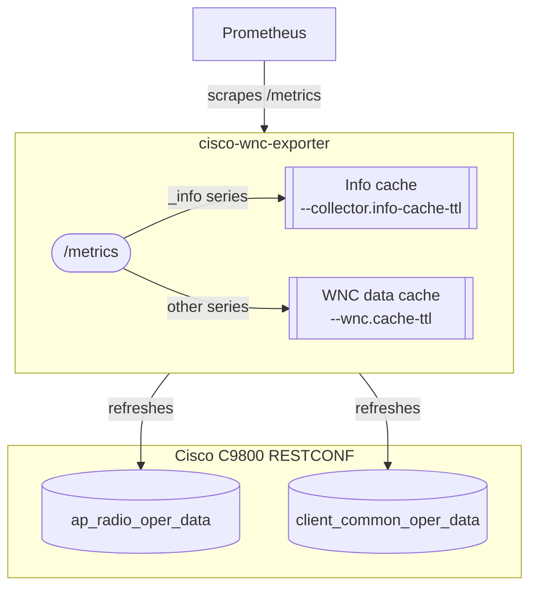
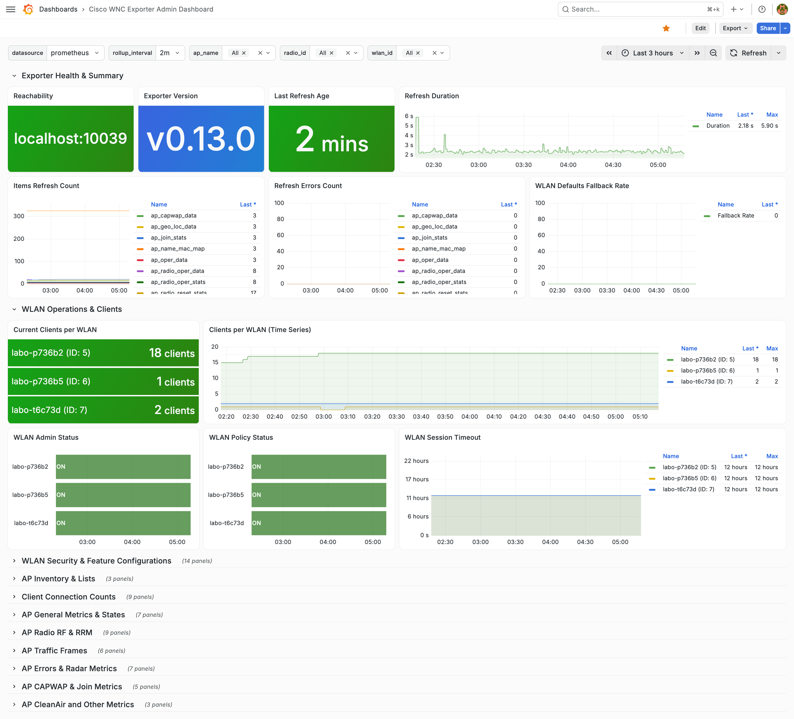
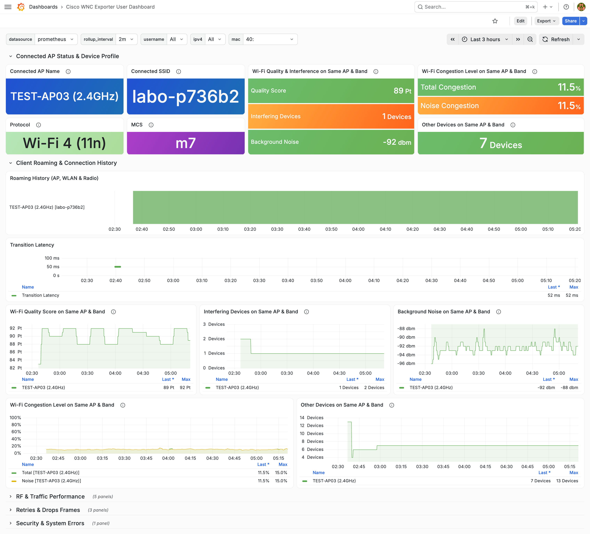

<div align="center">

  <picture>
    <source media="(prefers-color-scheme: dark)" srcset="./docs/assets/logo_dark.png" width="115px" />
    <source media="(prefers-color-scheme: light)" srcset="./docs/assets/logo.png" width="115px" />
    
  </picture>

  <h1>cisco-wnc-exporter</h1>

  <p>A third-party Prometheus Exporter for Cisco C9800 Wireless Network Controller.</p>

  <p>
    
    <a href="https://github.com/umatare5/cisco-wnc-exporter/actions/workflows/go-test-build.yml"></a>
    
    <a href="https://github.com/umatare5/cisco-wnc-exporter/actions/workflows/go-vulncheck.yml"></a><br>
    <a href="https://www.bestpractices.dev/projects/11293"></a>
    <a href="./LICENSE"></a>
    <a href="https://developer.cisco.com/codeexchange/github/repo/umatare5/cisco-wnc-exporter"></a>
  </p>

</div>

## Overview

This exporter allows a Prometheus instance to scrape metrics from [Cisco Catalyst 9800 Wireless Controllers](https://www.cisco.com/site/us/en/products/networking/wireless/wireless-lan-controllers/catalyst-9800-series/index.html).

- 🛡️ **State Monitoring**: Detects misconfigured APs and the enabled/disabled states of APs, radios and WLANs
- 🌐 **Connectivity Tracking**: Tracks client signal, speed, protocol, traffic, latency and associating APs
- 📊 **Long-Term Observability**: Extends metric retention beyond the builtin implementation
- ↩️ **Pull-Based Telemetry**: Scrapes via RESTCONF instead of push-based [Streaming Telemetry](https://www.cisco.com/c/en/us/td/docs/wireless/controller/9800/17-15/config-guide/b_wl_17_15_cg/streaming-telemetry-on-Cisco-Catalyst-9800-series-wireless-controller.html)

## Architecture

Prometheus pulls from the exporter, and the exporter pulls from the controller on its own schedule.



> [!NOTE]
> Scrapes read the last completed refresh, never waiting on the controller. See [Scrape Path](docs/architecture.md#scrape-path) for the details.

## Supported Versions

**Cisco Catalyst 9800 Wireless Controller on IOS-XE:**

- **17.12.x** – 17.12.5 or later
- **17.15.x** – 17.15.6 or later
- **17.18.x** – 17.18.4a or later

> [!IMPORTANT]
> This exporter requires these minimum versions due to RESTCONF defects in earlier releases. It fails on **17.15.4b** and **17.18.1**. See [cisco-ios-xe-wireless-go #28](https://github.com/umatare5/cisco-ios-xe-wireless-go/issues/28) and [cisco-ios-xe-wireless-go #29](https://github.com/umatare5/cisco-ios-xe-wireless-go/issues/29) for details.

## Installation

This exporter supports container images and OS-specific binaries.

```bash
docker pull ghcr.io/umatare5/cisco-wnc-exporter
```

Or, download the binaries from [Releases](https://github.com/umatare5/cisco-wnc-exporter/releases). `(linux|darwin)_(amd64|arm64)` and `windows_amd64` are supported.

## Quick Start

This exporter needs to enable RESTCONF and HTTPS on the Catalyst 9800 Wireless Controller first.

See the [Programmability Configuration Guide, Cisco IOS XE 17.15.x - RESTCONF](https://www.cisco.com/c/en/us/td/docs/ios-xml/ios/prog/configuration/1715/b_1715_programmability_cg/restconf_protocol.html#id_125840) for enabling the features.

### 1. Generate a Basic Auth token

```bash
# username:password → Base64 Encode
echo -n "admin:your-password" | base64
# Output: YWRtaW46eW91ci1wYXNzd29yZA==
```

### 2. Set the environment variables

```bash
export WNC_CONTROLLER="wnc1.example.internal"
export WNC_ACCESS_TOKEN="YWRtaW46eW91ci1wYXNzd29yZA=="
```

### 3. Run the exporter with Docker

```bash
docker run -p 10039:10039 -e WNC_CONTROLLER -e WNC_ACCESS_TOKEN \
  ghcr.io/umatare5/cisco-wnc-exporter:v0.15.0 --collector.ap.general
```

### 4. Scrape the metrics

```bash
curl http://localhost:10039/metrics
```

> [!TIP]
> See [Collectors](#collectors) for the complete metrics, and [Prometheus Configuration](#prometheus-configuration) for scrape jobs and alerting rules.

## Configuration

This exporter uses command-line flags for all configuration.

### Flags

`cisco-wnc-exporter --help` prints full flags. See [Help](docs/help.md) for details.

| Component | Flag            | Description                                                             |
| :-------- | :-------------- | :---------------------------------------------------------------------- |
| Collector | `--collector.*` | Which collectors register. See [Collectors](#collectors).               |
| Endpoint  | `--web.*`       | The listen address and the telemetry path. See [Endpoints](#endpoints). |
| Exporter  | `--wnc.*`       | Controller credentials and refresh pacing.                              |

### Collectors

The `--collector.*` flags toggle these collectors. See the pages below for details.

| Collector                                                | Flag                       | Description                                        |
| :------------------------------------------------------- | :------------------------- | :------------------------------------------------- |
| **[AP Collector](docs/collector.ap.md)**                 | `--collector.ap.*`         | RF foundation and radio performance metrics        |
| **[Client Collector](docs/collector.client.md)**         | `--collector.client.*`     | User experience and connection performance metrics |
| **[WLAN Collector](docs/collector.wlan.md)**             | `--collector.wlan.*`       | Logical SSID performance metrics                   |
| **[Controller Collector](docs/collector.controller.md)** | `--collector.controller.*` | Controller-wide metrics                            |

> [!IMPORTANT]
> All collectors are **disabled by default**. Enable them based on the requirements.

### Endpoints

The exporter exposes these endpoints. See [Endpoints](docs/architecture.md#endpoints) for what each status code means.

| Path       | Description                                     |
| :--------- | :---------------------------------------------- |
| `/`        | Landing page, confirming the exporter is up     |
| `/metrics` | Metrics endpoint, set by `--web.telemetry-path` |
| `/healthz` | Liveness probe, ignoring controller state       |

## Metrics

This exporter exposes metrics for various aspects of the wireless network.

### Collector Metrics

The following table summarizes the popular metrics. See [Collectors](#collectors) for the complete metrics.

| Collector | Metric                             | Type  | Description                     |
| :-------- | :--------------------------------- | :---- | :------------------------------ |
| AP        | `wnc_ap_clients`                   | Gauge | Run-state clients count         |
| AP        | `wnc_ap_channel_utilization_ratio` | Gauge | Channel utilization ratio (CCA) |
| Client    | `wnc_client_speed_mbps`            | Gauge | Negotiated PHY rate             |
| Client    | `wnc_client_rssi_dbm`              | Gauge | Signal strength (dBm)           |
| WLAN      | `wnc_wlan_enabled`                 | Gauge | WLAN status                     |
| WLAN      | `wnc_wlan_clients`                 | Gauge | Run-state clients count         |

### Exporter Health Metrics

The following table summarizes the health metrics of the exporter itself. See [Exporter Health](docs/health.md) for details.

| Metric                         | Type    | Description                        |
| :----------------------------- | :------ | :--------------------------------- |
| `wnc_up`                       | Gauge   | Last completed refresh reached WNC |
| `wnc_refresh_duration_seconds` | Gauge   | Duration of the last attempt       |
| `wnc_refresh_errors_total`     | Counter | Failed fetches per data type       |

## Examples

There are several operational examples below.

### Exporter Configuration

The three patterns below cover the common use cases.

**Minimal Pattern**: By default, the exporter publishes `wnc_build_info` alone.

```bash
./cisco-wnc-exporter
```

**Standard Pattern**: The three general groups cover the APs, the clients and the WLANs.

```bash
./cisco-wnc-exporter --collector.ap.general --collector.client.general --collector.wlan.general
```

**Complete Pattern**: Every group registers, and each `--collector.*.info-labels` flag takes its widest set.

```bash
./cisco-wnc-exporter \
  --collector.ap.general \
    --collector.ap.radio --collector.ap.traffic --collector.ap.errors \
    --collector.ap.join --collector.ap.geolocation --collector.ap.spectrum \
    --collector.ap.info \
    --collector.ap.info-labels "name,ip,band,model,serial,sw_version,eth_mac" \
  --collector.client.general \
    --collector.client.radio --collector.client.traffic --collector.client.errors \
    --collector.client.info \
    --collector.client.info-labels "ap,band,wlan,wlan_id,name,device_type,username,ipv4,ipv6" \
  --collector.wlan.general \
    --collector.wlan.traffic --collector.wlan.config \
    --collector.wlan.info \
    --collector.wlan.info-labels "name" \
  --collector.controller.general
```

> [!NOTE]
> See [`.air.toml`](.air.toml) for the development configuration this pattern is taken from.

### Prometheus Configuration

See the following Prometheus configuration examples:

- **Example Job**: Add from [`examples/prometheus.yml`](./examples/prometheus.yml) to your Prometheus.
- **Example Alerting Rules**: Add from [`examples/prometheus_alert_rules.yml`](./examples/prometheus_alert_rules.yml) to your Prometheus.

### Grafana Dashboard

Two layer of dashboards are available: The admin-level dashboard and the user-level dashboard

**Admin-level**: Import [`examples/grafana_cisco-wnc-exporter-admin-dashboard.json`](./examples/grafana_cisco-wnc-exporter-admin-dashboard.json) and visualize the metrics.

<picture>
  <source media="(prefers-color-scheme: dark)" srcset="./docs/assets/cisco-wnc-exporter-admin-dashboard_dark.png">
  <source media="(prefers-color-scheme: light)" srcset="./docs/assets/cisco-wnc-exporter-admin-dashboard.png">
  
</picture>

> [!TIP]
> See [`docs/assets/cisco-wnc-exporter-admin-dashboard_full.png`](./docs/assets/cisco-wnc-exporter-admin-dashboard_full.png) for the full capture.

**User-level**: Import [`examples/grafana_cisco-wnc-exporter-user-dashboard.json`](./examples/grafana_cisco-wnc-exporter-user-dashboard.json) and visualize the metrics.

<picture>
  <source media="(prefers-color-scheme: dark)" srcset="./docs/assets/cisco-wnc-exporter-user-dashboard_dark.png">
  <source media="(prefers-color-scheme: light)" srcset="./docs/assets/cisco-wnc-exporter-user-dashboard.png">
  
</picture>

> [!TIP]
> See [`docs/assets/cisco-wnc-exporter-user-dashboard_full.png`](./docs/assets/cisco-wnc-exporter-user-dashboard_full.png) for the full capture.

## Documentation

The following pages detail additional information.

- **[Architecture](docs/architecture.md)** – the scrape path, the absence rules and the design principles.
- **[Enumeration Values](docs/enums.md)** – the number each enumerated family reports.

## Contributing

See [`CONTRIBUTING.md`](CONTRIBUTING.md) for development setup, test conventions and others.

## License

MIT. The binary statically links Apache-2.0, MIT and BSD 3-Clause dependencies. Their notices are reproduced in [`NOTICE`](NOTICE) and shipped alongside [`LICENSE`](LICENSE) in every release archive and container image.
