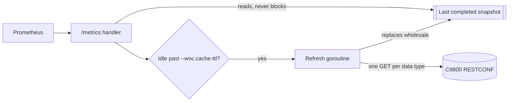

# Architecture

This document preserves the foundational design and architectural principles of the cisco-wnc-exporter.

## Scrape Path

Every scrape is served from the last completed refresh. No scrape waits on the controller.



The [`--wnc.cache-ttl`](../internal/config/config.go#L24) flag sets the minimum idle between refresh completions. It is not an expiry on the snapshot, and a faster scrape rate cannot shorten it. A refresh is bounded at [twice that idle](../internal/wnc/cache.go#L64).

The exporter records a data type the refresh never reached as a failure rather than publishing it as a zero. One refresh reads only the data types the enabled collectors need, meaning a client-only deployment never fetches `ap_capwap_data`, leaving more of the deadline for the rest.

The [`--wnc.timeout`](../internal/config/config.go#L23) flag bounds an entire request, while the SDK caps response headers and the TLS handshake at five seconds each without a flag. [Three consecutive refreshes](../internal/wnc/cache.go#L71) in which every fetch failed withhold the data series. A partial failure publishes a snapshot and resets that count.

The refresh starts on the first scrape arriving after the idle elapses. The period a dashboard sees is a multiple of the scrape interval:

```text
P = scrape_interval * ceil((cache-ttl + R) / scrape_interval)
```

The `R` variable is the refresh duration, which `wnc_refresh_duration_seconds` reports. The `P` variable is 120s for `R` above 5s and up to 65s, at the [default 55s TTL](../internal/config/config.go#L24) and a 60s `scrape_interval`.

## Endpoints

The exporter serves `/metrics`, `/healthz` and a landing page at `/`. None inspects the method.

| Path       | Methods | Status        | Behavior                                               |
| :--------- | :------ | :------------ | :----------------------------------------------------- |
| `/metrics` | Any     | 200, 500, 503 | 500 on registry error, 503 past ten concurrent scrapes |
| `/healthz` | Any     | 200           | Static `OK`, reading no state                          |
| `/`        | Any     | 200           | Catch-all landing page, never 404                      |

The `/` route matches every unclaimed path, so an unknown one returns the landing page. Setting `--web.telemetry-path` to `/` suppresses the landing page.

The `/healthz` endpoint returns a static 200 without reading the registry, the snapshot or the controller. This makes it a liveness probe and never a readiness one. Reflecting the WNC state in `/healthz` would let an orchestrator kill the exporter during a controller outage, taking the stale snapshot and the [Exporter Health](health.md) series down with it.

An unreachable controller withholds series rather than failing the scrape, so `/metrics` stays 200. Only a registry error gives 500, and an [eleventh concurrent scrape](../internal/server/server.go#L23) gives 503.

## Absence

A C9800 omits a leaf whose value equals its schema default. Absence on the wire is not a reading, and publishing `0` for it invents one.

The exporter withholds a series where the SDK types the leaf as a pointer, where an enum leaf arrives empty or unnumbered, and where a value-typed leaf reads a value that cannot be a measurement. For example, `wnc_ap_channel_energy_dbm` [rejects `0` and `-128`](../internal/collector/ap.go#L862).

Every remaining value-typed leaf decodes an omitted leaf as `0`, and the HELP string says so. A leaf omitted because the feature is enabled reads as its inverse when taken for `0`. For example, `wpa2-enabled` is absent from exactly the WLANs that enable WPA2.

Absence is per leaf rather than per container. A sibling series being present is no evidence that this one's leaf was sent.

A failed fetch withholds the series rather than publishing `0`. A zero is never a failed fetch, though it can still be the decoded zero of an omitted value-typed leaf.

The controller writes the 1970 epoch for an event that has not happened, and every timestamp series withholds that value rather than publishing it. A controller or image carrying no such data type answers `404`. This counts as a failure because a path the exporter got wrong answers `404` too.

The `wnc_refresh_defaults_fallback_total` counter rises only where the controller refuses the request for the values in force, so a flat counter is no proof that no `0` stands for a leaf never sent.

## Info Caching

The [`--collector.info-cache-ttl`](../internal/config/config.go#L25) flag serves the `_info` series from a snapshot up to that old. Every other series is collected on the scrape itself.

The collector behind the info series still runs on every scrape. The cache spares the controller no request and reduces no cardinality, and every label value a series has held remains its own series. A client that roamed keeps its previous `ap` label, and a newly associated client is missing altogether because the snapshot predates both.

A `group_left` fails outright where the info side holds two series for one key because the match group is ambiguous. It returns nothing where it lacks the join label.

## Update Schedule

The counters, RSSI and SNR are read on the controller's own schedule, not at scrape time. The `rate()` and `increase()` functions need a range spanning several of those updates.

The `show ap dot11 {24ghz | 5ghz | 6ghz} monitor` command reports the RRM coverage, load and measurement intervals in force. The AP profile `stats-timer` sets the statistics period. No series dates a per-radio record, so a scrape cannot tell one that just refreshed from one untouched since the previous scrape.

Whether a counter leaf is maintained at all depends on the AP model and the image. A counter reading zero is an observation rather than a platform property.

## Counter Semantics

A per-radio counter is anchored at its own AP's boot rather than at its CAPWAP join. An AP re-joining does not reset it and a reboot does. A reset touches that AP's series alone, so its two radios can anchor separately.

A client's counters restart when it re-associates. The statistics belong to the association rather than to the device.

Query over a range long enough to absorb a re-join or a re-association. A reset window left inside the range charges the whole counter as one increase.

Gate on the age of the association rather than on the counter, matching on `mac` because `wnc_ap_association_uptime_seconds` carries no `radio` label. Set the age above the range by a margin:

```text
rate(wnc_ap_fcs_errors_total[15m]) > 0 and on(mac) wnc_ap_association_uptime_seconds > 960
```

## Enumerated States

Twelve families publish the number the controller's own enumeration assigns the spelling it sent. The reading is in the value and none carries a `state` label.

[Enumeration Values](enums.md) lists every spelling with its number and names each family's `0`. This zero means a different thing in each family.

A spelling that page does not carry is withheld rather than published. One subject's series can disappear while the rest keep publishing.

Match the healthy value by equality rather than by threshold, and pair it with a `for:` longer than a legitimate transition takes.

## Dashboards

The bundled dashboards join the data series onto an `_info` series to recover a readable name. They join on `band`, `ap`, `wlan` and `username`. The default `--collector.*.info-labels` sets omit them, so a flag has to name them.

A join multiplies the data series by the info series and pulls the label across with `group_left`. The `info` group flag behind whichever `_info` the join names has to be set as well as the data one.
